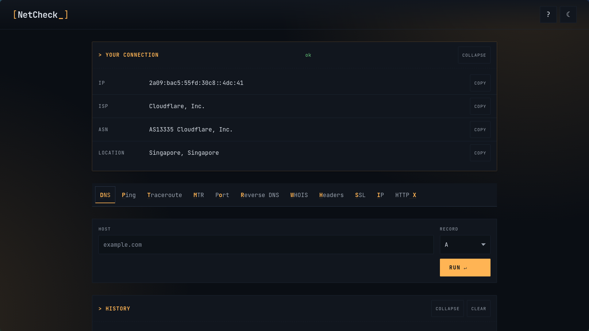

# NetCheck

> Self-hosted single-page network diagnostic toolkit. DNS, ping, traceroute, MTR, port, reverse DNS, WHOIS, headers, SSL, HTTP — one tab, no accounts, your IP never reaches the target.



## Demo

Live public demo available at: [netcheck.nnt25.io.vn](https://netcheck.nnt25.io.vn)

> [!NOTE]
> **Privacy Note:** History is stored in your browser's localStorage only (not on the server). Your queries are private to your browser and not visible to other users. However, on a public demo, your queries do reach the demo server's backend and may appear in server logs. For maximum privacy, self-host your own instance.

## Features

- **Origin-leak-free probes** — ping, traceroute, MTR, port-check, SSL, and HTTP all go through the [Globalping](https://globalping.io) API, so the target sees a third-party probe IP, not your server.
- **Real leak detection** — `/api/ip` detects your actual egress IP even when other tools miss it. Catches misconfigured VPN tunnels (e.g., Amnezia WireGuard with 0.0.0.0/0 that leaks your real IP) that pass basic "what's my IP" checks. See Privacy section for details.
- **Probe location selector** — Worldwide (default) / NA / EU / AS / SA / AF / OC on every probe-style tab.
- **Live spinner with elapsed-time counter** on every Globalping-backed request (3-5 s typical round-trip).
- **10 tools in one page** — DNS lookup, Ping, Traceroute, MTR, Port check, Reverse DNS, WHOIS (with IANA two-hop fallback and a friendly message for ccTLDs that publish no WHOIS server), Headers, SSL certificate inspector, HTTP response checker.
- **WHOIS resilience** — falls back to a raw `whois.iana.org` → TLD-server socket query when `python-whois` doesn't know a TLD.
- **No accounts, no cookies, no tracking** — see the Privacy section.
- **Terminal aesthetic** — dark by default, JetBrains Mono, amber accent, sharp corners, full keyboard navigation.
- **Shareable URLs** — every successful run encodes its inputs in the URL; reload the page and it re-runs.
- **History** — last 10 runs in `localStorage`, click any to re-run.
- **WCAG-friendly** — semantic HTML, `role=tablist`, `aria-busy` on result, keyboard shortcuts dialog (`?`).

## Prerequisites

Before running NetCheck, ensure you have:

- **Docker** (20.10+) or **Docker Compose** (v2+)
- **Port 7070** available (or change the port mapping)
- **Internet access** for:
  - Globalping API (required for ping/traceroute/MTR/port/SSL/HTTP)
  - ip-api.com (required for IP geolocation)
  - WHOIS servers (required for WHOIS lookups)
  - BKNS API (optional, for .vn domain WHOIS)

**Optional but recommended:**
- Reverse proxy (nginx/Caddy/Traefik) for HTTPS and custom domain
- `AUTH_TOKEN` for internet-facing deploys
- `GLOBALPING_TOKEN` for higher rate limits (250 → 500+ measurements/hour)

## Quick start

### Option 1: Docker run (fastest)

```bash
# Pull and run in one command
docker run -d -p 7070:7070 --name netcheck xyzulu/netcheck:latest

# Check it's running
docker ps | grep netcheck

# View logs (optional)
docker logs netcheck
```

**What happens:**
- Container starts on port 7070
- Health check runs every 30s
- No data persistence needed (history stored in browser only)

**Access:** Open <http://localhost:7070> in your browser.

### Option 2: Docker Compose (recommended for production)

1. Create `docker-compose.yml`:

```yaml
services:
  netcheck:
    image: xyzulu/netcheck:latest
    container_name: netcheck
    restart: unless-stopped
    ports:
      - "7070:7070"
    environment:
      # Optional: Uncomment and set for production
      # AUTH_TOKEN: "your-random-32-char-token-here"
      # ALLOW_PRIVATE_TARGETS: "0"  # Block private IPs (recommended for public deploys)
      # TRUSTED_PROXIES: "127.0.0.1"  # Only trust localhost proxy
      # RATE_LIMIT: "10/minute"
      # GLOBALPING_TOKEN: "your-globalping-token"  # Optional, for higher limits
      # BKNS_API_KEY: "your-bkns-api-key"  # Optional, for .vn domains
```

2. Start the container:

```bash
docker compose up -d
```

3. Verify it's running:

```bash
docker compose ps
docker compose logs
```

**Access:** Open <http://localhost:7070> in your browser.

### What you'll see

- **Your connection card** — Your IP, ISP, ASN, location (auto-detected)
- **10 diagnostic tabs** — DNS, Ping, Traceroute, MTR, Port, Reverse DNS, WHOIS, Headers, SSL, HTTP
- **Dark theme by default** — Toggle with sun/moon icon (top-right)
- **Keyboard shortcuts** — Press `?` to see all shortcuts

### First test

Try a simple DNS lookup:
1. Click the **DNS** tab
2. Enter `google.com` in the hostname field
3. Click **Run** or press `Ctrl+Enter`
4. See A records in ~1 second

### Next steps

- **For LAN scanning:** Set `ALLOW_PRIVATE_TARGETS=1` in environment
- **For internet-facing deploy:** Set `AUTH_TOKEN` and `ALLOW_PRIVATE_TARGETS=0`
- **For custom domain:** See [Reverse-proxy notes](#reverse-proxy-notes) below
- **For deployment scenarios:** See [SECURITY.md](./SECURITY.md) for 8 deployment cases

## Environment variables

| Variable                  | Default                          | Effect                                                                                                                              |
| ------------------------- | -------------------------------- | ----------------------------------------------------------------------------------------------------------------------------------- |
| `AUTH_TOKEN`              | unset                            | When set, every `/api/*` request requires `Authorization: Bearer <token>`. Recommended for internet-facing deploys.                |
| `ALLOW_PRIVATE_TARGETS`   | `0` (blocked)                    | **v1.2.0+** Controls whether private/loopback IPs can be scanned. `1` = allow (for LAN scanning), `0` = block (for public deploys). |
| `TRUSTED_PROXIES`         | `127.0.0.1,172.16.0.0/12`        | **v1.2.0+** Comma-separated IPs/CIDRs whose `X-Forwarded-For` headers are trusted for rate limiting. Never use `*` in production.  |
| `RATE_LIMIT`              | `10/minute`                      | Per-IP, per-endpoint rate. Format: `<n>/<second\|minute\|hour\|day>`.                                                              |
| `ALLOWED_ORIGINS`         | empty                            | CORS: empty = same-origin only, `*` = any origin, comma-separated list otherwise.                                                  |
| `GLOBALPING_TOKEN`        | unset                            | Optional. Anonymous Globalping = 250 measurements/h; sign-in raises the cap. Get a token at <https://globalping.io>.                |
| `GLOBALPING_API`          | `https://api.globalping.io/v1`   | Override the Globalping API base URL (rarely needed).                                                                              |
| `BKNS_API_KEY`            | unset                            | Optional. BKNS Whois API key for .vn domains. Without key: 10 req/min. With partner key: 300 req/min. Get key at <https://bkns.vn>. |

## Security

NetCheck is designed for homelab and single-tenant use. For production deployments, follow these guidelines:

### SSRF Protection (v1.2.0+)

- **Private target blocking:** By default, private/loopback/link-local IPs are blocked on all probe endpoints
- **Control:** Set `ALLOW_PRIVATE_TARGETS=1` only for trusted LAN scanning deployments
- **Affected endpoints:** `/api/dns`, `/api/rdns`, `/api/ping`, `/api/traceroute`, `/api/mtr`, `/api/port`, `/api/http`, `/api/ssl`

### Authentication

- **Public deploy (default):** No auth required, rate-limited to 10 req/min per IP
- **Private deploy:** Set `AUTH_TOKEN` to require `Authorization: Bearer <token>` on all `/api/*` requests
- **Token generation:** Use a cryptographically random 32+ character string

```bash
# Generate a secure token (Linux/macOS)
openssl rand -hex 32
```

### Rate Limiting

- **Default:** 10 requests/minute per IP per endpoint
- **Bypass risk:** If `TRUSTED_PROXIES` is misconfigured, attackers can forge `X-Forwarded-For` headers
- **Safe config:** Set `TRUSTED_PROXIES` to your reverse proxy's IP/CIDR only, never `*`

### Deployment Scenarios

NetCheck supports 8 deployment topologies with different security profiles:

| Scenario | Use Case | Key Settings |
|----------|----------|--------------|
| **A: Localhost only** | Personal use, no network exposure | `TRUSTED_PROXIES=` (empty) |
| **B: LAN-exposed** | Homelab, trusted network | `AUTH_TOKEN` + `ALLOW_PRIVATE_TARGETS=1` |
| **C: Host-networking + nginx** | Recommended for LAN scanning | `TRUSTED_PROXIES=127.0.0.1` + `ALLOW_PRIVATE_TARGETS=1` |
| **D: Docker bridge + nginx** | Standard reverse proxy setup | `TRUSTED_PROXIES=172.16.0.0/12,127.0.0.1` |
| **E: Behind Cloudflare/LB** | Internet-facing, authenticated | `AUTH_TOKEN` + `ALLOW_PRIVATE_TARGETS=0` + `TRUSTED_PROXIES=<LB-IPs>` |
| **F: Public demo** | Unauthenticated, rate-limited | `ALLOW_PRIVATE_TARGETS=0` + `RATE_LIMIT=5/minute` |
| **G: Kubernetes Ingress** | K8s deployment | `AUTH_TOKEN` + `TRUSTED_PROXIES=10.0.0.0/8` |
| **H: Air-gapped lab** | No internet, local tools only | `ALLOW_PRIVATE_TARGETS=1` |

**Full deployment matrix:** See [SECURITY.md](./SECURITY.md) for detailed configuration examples, threat model, and hardening checklist.

### Security Headers (enabled by default)

- **CSP:** `default-src 'self'` (blocks inline scripts, external resources except Google Fonts)
- **X-Frame-Options:** `DENY` (prevents clickjacking)
- **X-Content-Type-Options:** `nosniff` (prevents MIME sniffing)
- **Referrer-Policy:** `no-referrer` (no referrer leakage)
- **Permissions-Policy:** Blocks geolocation, microphone, camera, payment, USB

### What to Audit Before Going Public

- [ ] `AUTH_TOKEN` set to ≥32 random characters
- [ ] `ALLOW_PRIVATE_TARGETS=0` (unless you specifically need LAN scanning)
- [ ] `TRUSTED_PROXIES` matches your reverse proxy CIDR, never `*`
- [ ] `RATE_LIMIT` ≤ 10/minute for unauthenticated deploys
- [ ] Reverse proxy enforces HTTPS
- [ ] Logs shipped off-box for audit

## API endpoints

`location` is optional on probe-style endpoints. Valid magic codes: `world` (default, no constraint), `NA`, `EU`, `AS`, `SA`, `AF`, `OC`.

| Method | Path              | Body                                            | Returns                                                                                                    | Privacy                              |
| ------ | ----------------- | ----------------------------------------------- | ---------------------------------------------------------------------------------------------------------- | ------------------------------------ |
| GET    | `/api/ip`         | —                                               | `{ ip, isp, asn, country, city }`                                                                          | Direct (your IP → ip-api.com)        |
| POST   | `/api/dns`        | `{ host, type }`                                | `{ records, ttl, resolver }`                                                                               | Direct (origin DNS resolver)         |
| POST   | `/api/ping`       | `{ host, count, location? }`                    | `{ host, packets_sent, packets_recv, loss_pct, min, avg, max, raw }`                                       | **Globalping (no origin leak)**      |
| POST   | `/api/traceroute` | `{ host, max_hops, location? }`                 | `{ hops: [{ n, ip, hostname, latency_ms }] }`                                                              | **Globalping (no origin leak)**      |
| POST   | `/api/mtr`        | `{ host, location? }`                           | `{ host, hops: [{ n, ip, hostname, loss_pct, avg_ms, best_ms, worst_ms }] }`                               | **Globalping (no origin leak)**      |
| POST   | `/api/port`       | `{ host, port, timeout, location? }`            | `{ host, port, status }` (`open` / `closed` / `timeout`)                                                   | **Globalping (no origin leak)**      |
| POST   | `/api/rdns`       | `{ ip }`                                        | `{ ip, hostname }`                                                                                         | Direct (origin DNS resolver)         |
| POST   | `/api/whois`      | `{ target }`                                    | `{ raw, registrar, created, expires, nameservers }`                                                        | Direct (origin → TCP 43)             |
| GET    | `/api/headers`    | —                                               | `{ headers: { … } }`                                                                                       | Loopback only                        |
| POST   | `/api/ssl`        | `{ host, port, timeout, location? }`            | `{ host, port, subject, issuer, valid_from, valid_until, days_remaining, expired, san }`                   | **Globalping (no origin leak)**      |
| POST   | `/api/http`       | `{ url, location? }`                            | `{ url, status_code, status_text, response_time_ms, redirects, headers, tls }`                             | **Globalping (no origin leak)**      |
| GET    | `/api/healthz`    | —                                               | `{ status: "ok" }`                                                                                         | Loopback (Docker healthcheck)        |

All errors return `{ "error": "<code>", "message": "<human-readable>" }` with HTTP 400 / 401 / 403 / 422 / 429 / 500 / 502 / 504.

## Privacy

NetCheck is built so anyone can run it without leaking who they are.

**What never leaves your server**
- Your search history, your input values, and every API response stay on the client (`localStorage`, in-memory cache only). Nothing is logged, persisted, or forwarded.
- No analytics, no telemetry, no tracking pixels.
- No third-party scripts; the only off-origin resource is Google Fonts (JetBrains Mono stylesheet + WOFF files). Block it at your reverse proxy if you want zero off-origin requests.

**What does connect outward**
- **Globalping API** (`api.globalping.io`) — receives the target host/IP/URL you typed; runs the actual probe from a third-party node so the target never sees your origin.
- **ip-api.com** (`/api/ip` only) — plain GET, no API key, returns your egress IP + GeoIP. Used to populate the "Your connection" card.
- **`whois.iana.org` and TLD WHOIS servers** (`/api/whois`) — TCP 43 from your origin. Same caveat as any WHOIS client.
- **Origin DNS resolver** (`/api/dns`, `/api/rdns`) — your server's normal DNS path.

**Leak detection that other tools miss**

NetCheck's `/api/ip` endpoint detects your actual egress IP, not just what your VPN client reports. This catches misconfigured tunnels that other "what's my IP" tools miss.

**Example: Amnezia WireGuard leak**
- **Scenario**: WireGuard configured with `0.0.0.0/0` (full tunnel)
- **Other tools**: Show only the WireGuard tunnel IP → you think you're safe
- **NetCheck**: Still shows your real ISP IP → tunnel is leaking
- **Root cause**: Tunnel not properly configured, traffic bypassing VPN
- **Verification**: Switch to properly configured VLESS → leak disappears, NetCheck shows VPN IP only

If NetCheck shows your real IP while connected to a VPN, your tunnel is leaking. Don't trust the VPN client's status indicator alone.

The **WHOIS** and **Reverse DNS** tabs carry a small "⚠ Connects directly from your server" label in the UI so users know which queries originate from the host vs. from a remote probe.

**Local storage (browser)**
- `nc.history.v1` — last 10 runs (tool + inputs + summary), capped at 10, FIFO.
- `nc.tab.v1` — which tab was active.
- `nc.theme.v1` — `light` or `dark`.

No cookies. No fingerprinting. No background beacons. The WebRTC local-IP discovery is best-effort and runs in the browser only (modern browsers mDNS-mask private addresses; the UI labels this output `browser-detected`).

**Hardening that ships by default**
- Content-Security-Policy: `default-src 'self'` (Google Fonts whitelisted only for style+font, nothing else).
- `X-Content-Type-Options: nosniff`, `X-Frame-Options: DENY`, `Referrer-Policy: no-referrer`, `Permissions-Policy: geolocation=(), microphone=(), camera=(), payment=(), usb=()`.
- Same-origin guard middleware rejects `/api/*` requests whose `Origin`/`Referer` doesn't match the server `Host` (bypass via `AUTH_TOKEN` Bearer or `ALLOWED_ORIGINS=*`).
- Per-IP `slowapi` rate limit, 10 req/min/endpoint by default.
- RFC1918 / loopback / link-local / multicast / reserved targets blocked on probe-style endpoints when `AUTH_TOKEN` is unset.

## Tech stack

- **Backend**: Python 3.11 · FastAPI · uvicorn · slowapi · dnspython · python-whois · httpx (all version-pinned in `backend/requirements.txt`).
- **Frontend**: vanilla HTML + CSS + JS module. No framework. No build step. No bundler.
- **Probes**: Globalping public API (free anonymous tier, optional token for higher limits).
- **Container**: `python:3.11-slim`, single stage, non-root `netcheck:1000` user, JSON healthcheck.

## Reverse-proxy notes

**v1.2.0+ IMPORTANT:** Set `TRUSTED_PROXIES` to your reverse proxy's IP/CIDR to prevent rate-limit bypass via forged `X-Forwarded-For` headers.

### Configuration

`/api/ip` reads `X-Forwarded-For` / `X-Real-IP` to detect your real egress IP. If you put NetCheck behind nginx / Caddy / Traefik, the proxy must set one of those headers.

**Default behavior:**
- `TRUSTED_PROXIES=127.0.0.1,172.16.0.0/12` (trusts localhost + Docker bridge)
- Rate limiter uses client IP from `X-Forwarded-For` when request comes from trusted proxy
- Rate limiter uses TCP peer IP when request comes from untrusted source

**Security risk:** Setting `TRUSTED_PROXIES=*` allows any client to forge `X-Forwarded-For` and bypass rate limiting. Never use `*` in production.

### Examples

**nginx on same host (host-networking):**
```bash
# docker-compose.yml
environment:
  TRUSTED_PROXIES: "127.0.0.1"
```

**nginx on Docker bridge:**
```bash
# docker-compose.yml (default already covers this)
environment:
  TRUSTED_PROXIES: "127.0.0.1,172.16.0.0/12"
```

**Cloudflare / cloud LB:**
```bash
# docker-compose.yml
environment:
  TRUSTED_PROXIES: "173.245.48.0/20,103.21.244.0/22,..."  # Cloudflare IP ranges
```

Caddyfile example:

```
netcheck.example.com {
    reverse_proxy 127.0.0.1:7070
}
```

## Layout

```
netcheck/
├── backend/
│   ├── main.py             # FastAPI app + security headers + same-origin guard
│   ├── routers/            # one file per /api/* endpoint (11 routes)
│   ├── utils/              # validators, rate-limit, Globalping client
│   └── requirements.txt
├── frontend/
│   ├── index.html          # tabs, panels, IP card, shortcuts dialog
│   ├── style.css           # terminal-flavored design tokens
│   ├── app.js              # runners, history, share, theme, spinner
│   └── favicon.svg
├── Dockerfile
├── docker-compose.yml
├── .env.example
├── .gitignore
├── LICENSE                 # AGPL v3
└── README.md
```

## What it isn't

- Not a speed test.
- Not a DNS propagation checker.
- Not a graphical traceroute / GeoIP map.
- Not multi-user. No accounts, no audit log, no quota beyond per-IP rate limiting.

If you need those, this is the wrong tool.

## Troubleshooting

### Container won't start

**Check logs:**
```bash
docker logs netcheck
# or
docker compose logs
```

**Common issues:**
- Port 7070 already in use → Change port mapping: `-p 8080:7070`
- Permission denied → Run with `--user $(id -u):$(id -g)` or check Docker permissions

### "Your connection" card shows wrong IP

**Cause:** ip-api.com is down or blocked
**Fix:** Check `docker logs netcheck` for errors. No fix needed - card will retry on next page load.

### Globalping tools fail (ping/traceroute/MTR/port/SSL/HTTP)

**Symptoms:** "upstream_rate_limited" or "upstream_failure" errors

**Causes:**
1. Anonymous rate limit reached (250 measurements/hour)
2. Globalping API is down
3. Network connectivity issue

**Fixes:**
1. Get a free token at <https://globalping.io> and set `GLOBALPING_TOKEN`
2. Wait 1 hour for rate limit reset
3. Check `docker logs netcheck` for network errors

### WHOIS returns "No WHOIS server" for some TLDs

**Expected behavior:** Some ccTLDs (country-code TLDs) don't publish WHOIS servers. NetCheck shows a friendly message explaining this.

**Workaround:** Use the TLD's official registry website for manual lookup.

### Rate limiting too aggressive / too lenient

**Adjust:**
```bash
# docker-compose.yml
environment:
  RATE_LIMIT: "20/minute"  # Increase limit
  # or
  RATE_LIMIT: "5/minute"   # Decrease limit
```

### Can't scan private IPs (192.168.x.x, 10.x.x.x, 127.x.x.x)

**Expected behavior (v1.2.0+):** Private IPs are blocked by default for security.

**Fix for LAN scanning:**
```bash
# docker-compose.yml
environment:
  ALLOW_PRIVATE_TARGETS: "1"
```

**Warning:** Only enable this on trusted networks. Never enable on internet-facing deploys.

### Behind reverse proxy, rate limiting not working

**Cause:** `TRUSTED_PROXIES` misconfigured, clients can forge `X-Forwarded-For`

**Fix:**
```bash
# docker-compose.yml
environment:
  TRUSTED_PROXIES: "127.0.0.1"  # For nginx on same host
  # or
  TRUSTED_PROXIES: "172.16.0.0/12"  # For Docker bridge
```

**Never use:** `TRUSTED_PROXIES: "*"` (allows rate limit bypass)

### Still stuck?

1. Check [SECURITY.md](./SECURITY.md) for deployment-specific guidance
2. Check [GitHub Issues](https://github.com/yourusername/netcheck/issues) for known issues
3. Open a new issue with:
   - Docker version (`docker --version`)
   - Deployment scenario (localhost/LAN/internet-facing)
   - Relevant logs (`docker logs netcheck`)
   - Environment variables (redact `AUTH_TOKEN`)

## License

AGPL-3.0 © 2026 NNT. See [LICENSE](./LICENSE) for the full text.
